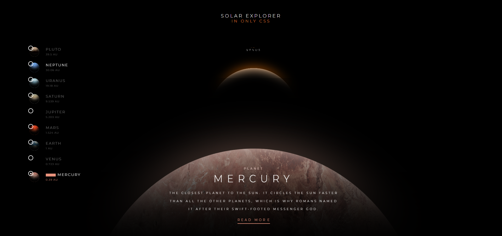
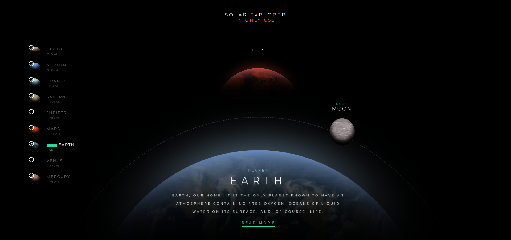
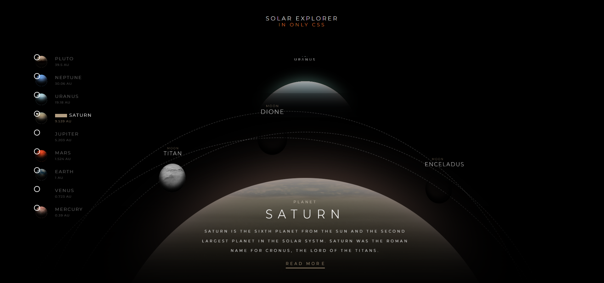
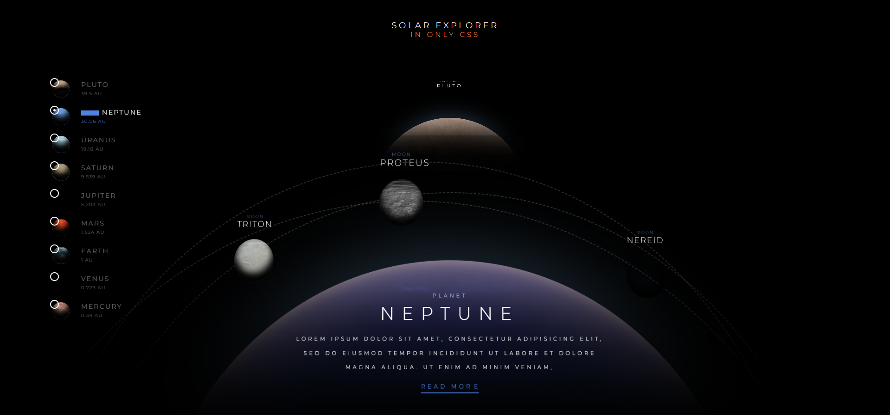

# 🪐 Solar System Explorer

A visually stunning, interactive 3D-like solar system explorer built entirely using **Pure CSS**. No JavaScript was used for the interactivity, demonstrating the power of modern CSS selectors and animations.

---

## 🚀 Overview

This application provides a highly realistic and interactive simulation of our solar system. It allows users to explore different planets, view their orbital paths, and read detailed astronomical facts, all through a fluid and responsive interface.

*   **Zero JavaScript**: All interactions, from planet selection to panel toggling, are handled via CSS radio-button logic.
*   **Immersive Design**: Uses glassmorphism, vibrant gradients, and smooth transitions to create a premium, space-like feel.
*   **Educational Content**: Includes accurate descriptions, distances (AU), and fun facts for every planet, including Pluto.

---

## ✨ Features

*   🌌 **Interactive Planet Selection**: Seamlessly switch between planets using the intuitive sidebar menu.
*   🛰️ **Dynamic Moon Trajectories**: Visual representation of moon orbits for Earth, Mars, Jupiter, and others.
*   📖 **Detailed Info Panels**: Expandable sections for each planet with high-quality imagery and structured data.
*   🌠 **Atmospheric Effects**: Subtle starfield animations and planetary glow effects for a realistic deep-space aesthetic.
*   📱 **Responsive Layout**: Designed to provide an optimal viewing experience across various screen sizes.

---

## 📸 Screenshots

<div align="center">
  
  <br>
  
  <br>
  
  <br>
  
</div>

---

## 🛠️ Tech Stack

*   **Structure**: HTML5 (Semantic elements for SEO and accessibility)
*   **Styling**: Pure CSS3 (Custom properties, 3D transforms, keyframe animations)
*   **Icons**: Font Awesome 4.7
*   **Logic**: CSS Sibling Combinators (`~`) and `:checked` pseudo-classes.

---

## ⚙️ How It Works

1.  **State Management**: The application uses hidden `<input type="radio">` elements to maintain the "state" of which planet is currently selected.
2.  **Interactivity**: When a user clicks a planet label, the corresponding radio button is checked. CSS then uses the `~` operator to modify the styles of the `.solar` and `.panel` elements based on which input is active.
3.  **Animations**: Orbital paths are created using circular borders and `transform-origin` properties, with continuous rotations handled by CSS `@keyframes`.
4.  **Glassmorphism**: The detail panels use `backdrop-filter: blur()` and semi-transparent backgrounds to achieve a modern, sleek look.

---

## 🚀 Getting Started

To run this project locally:

1.  Clone the repository:
    ```bash
    git clone https://github.com/amanverma0001/solar-system.git
    ```
2.  Open `index45.html` in any modern web browser.
3.  Enjoy the explorer!

---

### 👨‍💻 Author
**amanverma0001**
